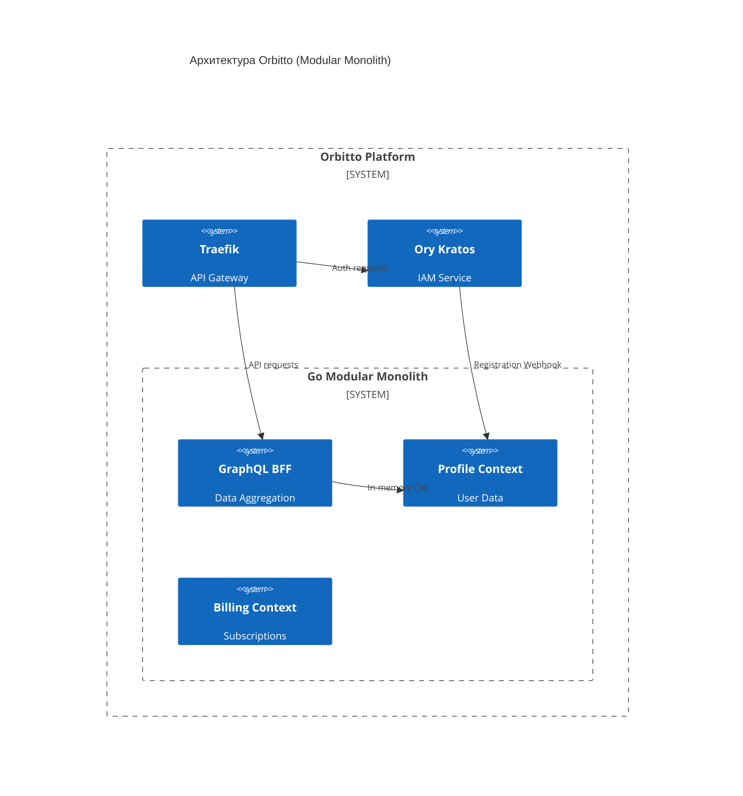

# Orbitto - Advanced Engineer Challenge

Решение инженерного челленджа по разработке системы аутентификации. Проект сфокусирован на чистой архитектуре, масштабируемости и инженерной строгости.

Вместо стандартного REST API мы используем **модульный монолит** ([ADR-006](docs/adr/ADR-006-deploy-strategy.md)), построенный по принципам **DDD**, **CQRS** и **Clean Architecture** ([ADR-005](docs/adr/ADR-005-go-ddd-lite-structure.md)). Все задачи аутентификации делегированы Ory Kratos, а бизнес-логика изолирована в Go-сервисах и доступна фронтенду через GraphQL BFF.

## Особенности

- **Разделение IAM и бизнеса**: Ory Kratos управляет аккаунтами, а Go-сервисы — профилями пользователей. Идентичность отделена от бизнес-данных ([ADR-001](./docs/adr/ADR-001-authentication-implementation-strategy.md#31-%D1%80%D0%BE%D0%BB%D1%8C-%D1%81%D0%B5%D1%80%D0%B2%D0%B8%D1%81%D0%B0-profile-%D1%81%D0%BB%D0%BE%D0%B9-%D0%BE%D1%80%D0%BA%D0%B5%D1%81%D1%82%D1%80%D0%B0%D1%86%D0%B8%D0%B8), [ADR-007](docs/adr/ADR-007-separate-profile-domain.md)).
- **Модульный монолит**: сервисы (Profile, Billing) изолированы в коде, но работают в одном процессе. Это упрощает деплой и позволяет легко перейти на микросервисы в будущем ([ADR-006](docs/adr/ADR-006-deploy-strategy.md)).
- **GraphQL BFF**: единая точка входа для фронтенда со строгой типизацией ([ADR-002](docs/adr/ADR-002-service-communication-protocol.md)).
- **Полная наблюдаемость**: встроенный стек Prometheus, Grafana, Loki и Tempo ([ADR-008](docs/adr/ADR-008-observability-stack.md)).
- **Infrastructure as Code**: окружение полностью поднимается через Docker Compose и Makefile.

---

## Технологический стек

### Backend (Go 1.26+)

Используем Go за его производительность и эффективную работу с конкурентностью. Архитектура построена на принципах DDD Lite.
*Обоснование:* [ADR-005](docs/adr/ADR-005-go-ddd-lite-structure.md).

### Frontend (React + TypeScript)

Стек: Vite, TanStack Router, TanStack Query, Tailwind CSS, shadcn/ui.
*Обоснование:* Выбран за типобезопасность и отличную работу с серверным состоянием без лишних стейт-менеджеров ([ADR-004](docs/adr/ADR-004-frontend-stack.md)).

### IAM и Auth (Ory Kratos)

Готовое решение для безопасности: пароли, восстановление доступа и 2FA. Интегрируется с системой через вебхуки.
*Обоснование:* [ADR-001](./docs/adr/ADR-001-authentication-implementation-strategy.md#2-%D0%BF%D1%80%D0%B8%D0%BD%D1%8F%D1%82%D0%BE%D0%B5-%D1%80%D0%B5%D1%88%D0%B5%D0%BD%D0%B8%D0%B5).

---

## Как запустить

### Требования

- Docker и Docker Compose
- Make (опционально, для запуска команд из Makefile)
- Node.js 20+ (для E2E тестов)
- Go 1.26+ (для локальных тестов)

### Быстрый старт

1. **Клонируйте проект и настройте окружение**:

    ```bash
    git clone git@github.com:kfreiman/engineer-challenge.git
    cd engineer-challenge
    cp .env.example .env
    ```

2. **Запустите систему**:

    ```bash
    make dev
    ```

Система поднимет сервисы с помощью Docker Compose.
Доступ к фронтенду по адресу `${ORBITTO_SCHEMA}${ORBITTO_HOSTNAME}:${ORBITTO_TRAEFIK_EXPOSE_HTTP_PORT}` (по умолчанию: `http://orbitto.localhost`). 

---

## Архитектура системы

### Взаимодействие компонентов



### Ключевые решения

1. **DDD & Ограниченные контексты**: Profile и Billing разделены на уровне кода ([ADR-007](docs/adr/ADR-007-separate-profile-domain.md)).
2. **CQRS**: Чтение данных (Queries) отделено от изменения состояния (Commands) для чистоты логики.
3. **Traefik как Edge Gateway**: управление всем трафиком извне через единую точку ([ADR-003](docs/adr/ADR-003-api-gateway-selection.md)).

### Режим разработки

Конфигурация файлов docker compose разделена по файлам:

- `compose.yaml` — основные сервисы
- `compose.dev.yaml` — разработка

В dev режиме запускаются все сервисы, включая вспомогательные для разработки, такие как Mailpit, Traefik Dashboard, etc. Так же, cервисы с поддержкой горячей перезагрузки (Traefik, Kratos) отслеживают изменения в конфигах и не требуют перезапуска.

Для golang используется утилита [air](https://github.com/cosmtrek/air), которая перезагружает сервис внутри контейнера при изменении кода.

Для фронтенда используется [vite](https://vitejs.dev/) с hot reload.

Для удобства отладки в dev-режиме все используемые порты сервисов проброшены в хостовую систему с помощью переменных окружения. В production-like режиме пробрасывается только порт reverse proxy Traefik (по-умолчанию, ORBITTO_TRAEFIK_EXPOSE_HTTP_PORT=80).

---

## Компромиссы (Trade-offs)

- **Модульный монолит вместо микросервисов**: Выбран как стратегия отложенного усложнения (Evolutionary Architecture). Паттерн обеспечивает строгую программную изоляцию Bounded Contexts и высокую скорость разработки, полностью исключая проблемы распределенных систем (сетевые отказы, обеспечение согласованности данных, распределенные транзакции) до момента наступления реальной инфраструктурной или организационной необходимости.. Подробнее: [ADR-006](docs/adr/ADR-006-deploy-strategy.md).
- **Синхронные вебхуки вместо очередей**: Kratos уведомляет бэкенд о регистрации через HTTP. Это проще в поддержке, чем Kafka/RabbitMQ, и достаточно надежно благодаря ретраям Kratos. Подробнее: [ADR-001](./docs/adr/ADR-001-authentication-implementation-strategy.md#5-%D0%BF%D0%BE%D1%81%D0%BB%D0%B5%D0%B4%D1%81%D1%82%D0%B2%D0%B8%D1%8F-%D0%B8-%D1%80%D0%B8%D1%81%D0%BA%D0%B8).
- **GraphQL вместо REST**: Дает фронтенду гибкость и строгую схему ([ADR-002](docs/adr/ADR-002-service-communication-protocol.md)).

---

## Тестирование

### E2E Тесты (Playwright)

E2E тесты проверяют полные пользовательские сценарии: регистрацию, подтверждение почты (через Mailpit), авторизацию и управление профилем. Проводится урощённое тестирование только в Chromium.

**Перед запуском тестов:**

1. Установите зависимости в корневой директории:

    ```bash
    pnpm install
    ```

2. Запустите все сервисы (некоторые тесты используют вспомогательные сервисы, такие как Mailpit, которые запускаются только в dev режиме):

    ```bash
    make dev
    ```

**Запуск тестов:**

- `npx playwright test` — запуск всех тестов.
- `npx playwright show-report` — просмотр отчета.

### Остальные тесты

- **Backend**: `make test-go` или `go test ./internal/...` (Unit и интеграционные тесты).
- **Frontend**: `make test-web` (Unit тесты компонентов).
- **Все сразу**: `make test`

---

## Makefile команды

Используйте `make help` для получения актуального списка всех доступных команд.

### Основной жизненный цикл

| Команда | Описание |
|---------|----------|
| `make dev` | Запуск всех сервисов в режиме разработки (development). |
| `make start` (`up`) | Запуск всех сервисов в режиме production. |
| `make stop` | Приостановка работы всех контейнеров. |
| `make down` | Остановка и удаление всех сервисов (production). |
| `make down-dev` | Остановка и удаление всех сервисов (development). |
| `make build` | Сборка Docker образов для production. |
| `make build-dev` | Сборка Docker образов для разработки. |
| `make logs` | Просмотр логов (production). |
| `make logs-dev` | Просмотр логов (development). |

### Качество кода и тестирование

| Команда | Описание |
|---------|----------|
| `make test` | Запуск всех тестов (Go и Web). |
| `make test-go` | Запуск тестов бэкенда. |
| `make test-web` | Запуск unit-тестов фронтенда. |
| `make test-e2e` | Запуск сквозных (end-to-end) тестов Playwright. |
| `make lint` | Запуск статического анализа кода (linters). |

### Генерация и обслуживание

| Команда | Описание |
|---------|----------|
| `make generate` | Полный цикл кодогенерации (Protobuf, GraphQL). |
| `make proto` | Генерация кода из Protobuf определений. |
| `make release` | Создание новой версии (коммит и тег). |
| `make release-dry` | Проверка процесса релиза без фиксации изменений. |
| `make clean` | Полная очистка временных файлов и Docker-ресурсов. |

### Работа с отдельными сервисами

| Шаблон команды | Описание |
|----------------|----------|
| `make [service]` | Запуск конкретного сервиса (например, `make core`). |
| `make [service]-dev` | Запуск сервиса в режиме разработки. |
| `make [service]-logs` | Просмотр логов конкретного сервиса. |

*Доступные сервисы:* `traefik`, `kratos_db`, `kratos`, `kratos_migrate`, `core`, `web`, `mailpit`, `billing`, `bff`, `profile`.
