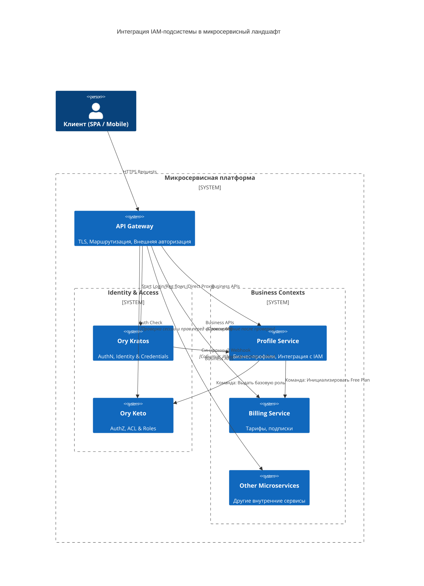
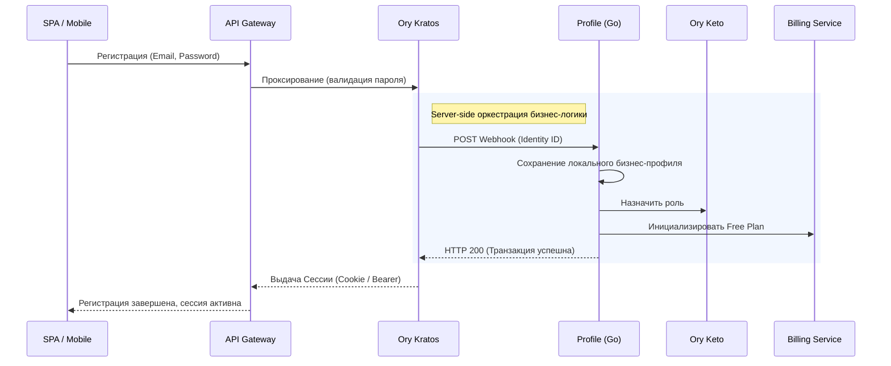

# ADR-001: Стратегия реализации подсистемы IAM (Ory Stack + API Gateway) и сервиса Profile

**Статус:** Принято  
**Дата:** 2026-03-07  
**Автор:** kfreiman

## 1. Контекст

Требуется разработать подсистему Identity and Access Management (IAM) для новой микросервисной платформы. Подсистема должна обеспечивать регистрацию, аутентификацию, восстановление пароля и управление правами пользователей.

**Архитектурные и бизнес-ограничения:**

1. **Интеграция с существующим ландшафтом:** В системе уже планируются независимые бизнес-домены: сервис биллинга (тарифы/подписки) и сервис курсов валют. Система аутентификации должна бесшовно интегрироваться с ними.
2. **Frontend-agnostic:** На данный момент не определено, как именно будет реализован клиентский слой. Архитектура IAM должна поддерживать различные механизмы (Cookie-based сессии для веба, API-токены для мобайла).
3. **Безопасность:** Недопустимо хранение паролей в открытом виде, требуется защита от атак типа Brute-force, XSS, CSRF и управление временем жизни сессий по стандартам индустрии ИБ.
4. **Слабая связность (Decoupling):** Инфраструктурные данные (хэши паролей, статусы проверки email) не должны смешиваться с бизнес-данными (баланс, выбранный тариф и т.п.).

### 1.1. Словарь терминов и базовые концепции IAM платформы

Для выравнивания понимания внутри команды мы фиксируем разделение ответственности IAM на следующие функции:

* **AuthN (Аутентификация):** Проверка "Кто это?".
* **AuthZ (Авторизация):** Проверка "Можно ли ему делать X?".
* **Identity:** Системная учетная запись в IAM-провайдере.
* **Credentials:** Секреты (пароли, хэши), которые никогда не должны покидать пределы IAM.
* **Traits / Claims:** Базовые идентификаторы валидации в IAM (Email, номер телефона). *Бизнес-профиль (настройки, привязка к тарифу) хранится на стороне наших бизнес-сервисов.*

## 2. Принятое решение

Мы внедряем распределенную подсистему IAM, состоящую из следующих компонентов:

1. **API Gateway (Edge Router)** — единая точка входа, отвечающая за TLS, маршрутизацию и первичную проверку прав.
2. **Ory Kratos** в качестве Identity Provider (отвечает строго за **AuthN**: управление учетными данными, паролями, сессиями).
3. **Ory Keto** в качестве Authorization Server (отвечает строго за **AuthZ**: управление графами доступов и ролями на базе Google Zanzibar).
4. **Profile Service (Go)** — наш кастомный микросервис, выступающий мастер-системой бизнес-профиля пользователя и связующим слоем (Anti-Corruption Layer) между инфраструктурой Ory и нашими бизнес-доменами.

### Почему выбрана именно эта связка?

Решение опирается на принцип **строгого разделения контекстов (Bounded Contexts)**. Мы делегируем ИБ-слой готовым инструментам (Ory), а в сервисе `Profile` оркестрируем бизнес-логику (создание баланса, выдача начального тарифа), реагируя на события от Kratos.

## 3. Архитектура и механизмы взаимодействия

### 3.1. Роль сервиса Profile (Слой оркестрации)

Главная архитектурная проблема: *Ory Kratos ничего не знает про наш бизнес, а другие доменные сервисы (Billing, Exchange) ничего не должны знать про механизмы регистрации и хэширования паролей.*

**Profile Service** решает эту проблему, забирая на себя функционал Onboarding/Offboarding процессов. Его ключевые задачи:

1. **Обработка Webhook-ов от Kratos:** `Profile` предоставляет эндпоинты, которые Kratos вызывает *синхронно* при успешной регистрации. Сервис валидирует схему от Kratos и принимает бизнес-решение о допуске пользователя.
2. **Profile Splitting (Разделение профиля):** Сервис берет сгенерированный в Kratos UUID пользователя и обогащает его, создавая в своей БД полноценный публичный `Бизнес-профиль` (Сущность Profile: UserID, Настройки интерфейса и т.п.).
3. **Инициализация прав (Связка Identity и Keto):** Kratos и Keto не общаются друг с другом напрямую. `Profile`, получив хук о новой регистрации, делает вызов в Keto: *"Назначь этому UUID базовую роль `user`"*.
4. **Saga / Бизнес-оркестрация:** На этапе онбординга `Profile` дает команду соседним доменам: например, вызывает сервис `Billing` для создания бесплатного тарифа (Free Plan) новому пользователю.
5. **Server-side безопасность:** Весь этот процесс происходит Backend-to-Backend. Мы не доверяем Frontend-у последовательно дергать API регистрации и биллинга (защита от "подвисших" полузарегистрированных аккаунтов).

### 3.2. Общая топология (C4 Container View)

### 3.3. Жизненный цикл регистрации и CQRS подход

* **Command Side (Запись):** Происходит через связку Kratos -> `Profile`. Kratos хэширует пароль и дергает хук (отправляя `Identity ID`). `Profile` оркестрирует создание профиля и тарифа.
* **Query Side (Чтение авторизации):** Для проверки прав на чтение (допустим, курсов валют), бизнес-сервисам не нужно опрашивать базу `Profile` или Kratos. API Gateway использует механизм авторизующего прокси (например, ForwardAuth), обращаясь к IAM-слою, извлекает `User-ID` из сессионной куки/токена и передает его в заголовках (например, `X-User-Id`) в целевые сервисы.

### 3.4. Внутренняя аутентификация (M2M)

Для общения микросервисов между собой (например, Billing запрашивает Exchange) прокси-шлюз обычно обходится. Доверие внутри защищенного сетевого контура организуется через взаимную mTLS аутентификацию (на уровне Service Mesh) либо выдачу статических внутренних Service-токенов, валидируемых локально.

## 4. Рассмотренные альтернативы

### 4.1. Разработка кастомного Auth-сервиса (Go + Postgres + JWT)

* **Плюсы:** Полный контроль над кодом.
* **Минусы:** Возложение ответственности за криптографию на команду разработки. Фатальные риски ИБ уязвимостей, трата ресурсов инженеров.
* **Решение:** Отклонено. IAM — это стандартная задача, решаемая готовыми Enterprise компонентами.

### 4.2. Использование монолитного OIDC провайдера (Keycloak)

* **Плюсы:** Решение "всё в одном" (AuthN + AuthZ).
* **Минусы:** UI тесно связан с сервером (через редиректы и шаблоны). Это рушит концепцию бесшовного нативного Mobile/SPA клиента. Экосистема Java имеет высокий overhead по потреблению ОЗУ для легковесного кластера.
* **Решение:** Отклонено в пользу Go-based Headless подхода (Ory), разделяющего контексты ИБ и бизнес-логики.

## 5. Последствия и риски

### Положительные (Pros)

1. **Безопасность (Zero Trust at Edge):** Бизнес-домены даже не касаются паролей. Аутентификация отсекается на уровне API Gateway.
2. **Слабая связность (Decoupling):** Падение сервиса Биллинга не влияет на способность системы авторизовывать пользователей.
3. **Сложные графы доступов:** Использование компонента Ory Keto позволяет бизнес-сервисам проверять права не через `if role == admin`, а через проверку отношений ("Есть ли у пользователя X доступ к объекту Y").

### Отрицательные / Риски (Cons/Risks)

1. **Риск десинхронизации (Split-brain):** Webhook от Kratos до сервиса `Profile` может упасть из-за моргания сети.
    * *Митигация:* Включение механизма Retry в Kratos. Строгая реализация идемпотентности (Idempotency) на стороне `Profile` (не пытаться создать профиль, роль или биллинг-подписку дважды при повторном webhook-e).
2. **Оверхед на инфраструктуру:** Необходимо разворачивать и поддерживать миграции отдельных баз данных для Kratos и Keto.
    * *Митигация:* Использование Helm-чартов и шаблонизации IaC (Terraform).
3. **Кривая обучения:** Работа через Ory Identity Schemas (JSON) вместо привычного декларативного кода БД.
