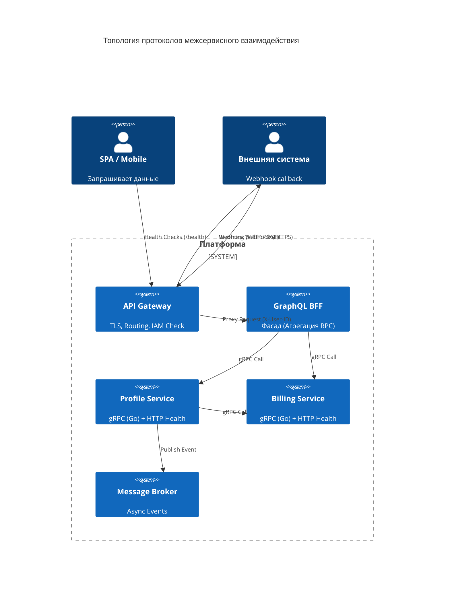

# ADR-002: Выбор протокола межсервисного взаимодействия

**Статус:** Принято  
**Дата:** 2026-03-07  
**Автор:** kfreiman

## 1. Контекст

Необходимо определить протоколы коммуникации между микросервисами (Service-to-Service, S2S) и для внешнего клиентского взаимодействия (Client-to-Service).

**Ограничения:**

1. **Политика проекта:** REST допустим только при наличии сильной архитектурной аргументации.
2. **Язык реализации:** Основной язык бэкенда — Go.
3. **Связь с другими ADR:** ADR-001 зафиксировал использование API Gateway, IAM (Ory) и микросервисов, но не выбрал протокол S2S. Данный ADR восполняет этот пробел.
4. **Инфраструктура:** Планируется развертывание в Kubernetes (решение в процессе). Использование Service Mesh (Linkerd/Istio) — возможный бонус, архитектура не зависит от него.

### 1.1. Роль инфраструктурных компонентов

- **API Gateway (Edge Gateway):** Входная точка в кластер, отвечающая за TLS-termination, маршрутизацию внешнего трафика и интеграцию с IAM для проверки сессий.
- **IAM (Ory Kratos / Keto):** Обеспечивают проверку личности и прав доступа. Gateway использует их для первичной фильтрации запросов.
- **BFF (Backend for Frontend):** Фасад в виде GraphQL Gateway, скрывающий сложность бэкенда от фронтенда (Web/Mobile) и оркеструющий запросы к микросервисам. Исторически не обговаривался в ADR-1, но вводится здесь как необходимый слой агрегации, чтобы снять эту ответственность с клиентов и избежать сильной связности UI с микросервисами.

### 1.2. Типы коммуникации

- **Синхронный S2S (RPC):** Вызовы между внутренними сервисами с ожиданием ответа (например, Profile Service проверяет статус в Billing Service).
- **Client-to-BFF (Внешние клиенты):** Запросы (Queries) и мутации (Mutations) от мобильных и веб клиентов к единой точке входа.
- **Асинхронный Event-Driven:** Публикация и подписка на события.
- **Server Streaming / Bi-directional Streaming (Потенциально):** Реал-тайм обновления или двунаправленная коммуникация. На данный момент не обговаривалось, но рассматривается как возможное требование к протоколу в будущем.

## 2. Принятое решение

### 2.1. Основной протокол для S2S: gRPC с Protocol Buffers

**gRPC** выбирается для синхронных сервисных вызовов:

- **Производительность:** Бинарная сериализация Protocol Buffers быстрее и создает меньший payload по сравнению с JSON.
- **Надежность контрактов:** Строгая типизация через IDL (`.proto` файлы) гарантирует согласованность между сервисами на этапе компиляции.
- **Разработка:** Автогенерация типизированных клиентов и серверов (в нашем случае для Go) снижает количество шаблонного кода.

### 2.2. Внешнее взаимодействие (Client-to-BFF): GraphQL

Для связи клиентских приложений с бекендом выбирается **GraphQL**:

- **Гибкость (Нет Over-fetching):** Одно из главных преимуществ перед REST — фронтенд запрашивает ровно те данные, которые ему нужны. Это критично для мобильных клиентов.
- **Единый граф (Schema-First):** Единая строго типизированная схема объединяет данные разных сервисов и служит контрактом для фронтенд-команды.
- **Оркестрация на сервере:** Запрос к BFF разбивается на параллельные или последовательные gRPC-вызовы. Клиенту больше не нужно делать N+1 REST-запросов к разным сервисам (например, сначала получить User, а потом запросить его Subscription), GraphQL-сервер агрегирует ответ сам.

**Поток авторизованного запроса:**
Клиент -> API Gateway -> IAM-проверка -> Gateway -> GraphQL Gateway (BFF) -> gRPC-Сервисы. Metadata о пользователе передаются в BFF через HTTP-заголовки (например, `X-User-ID`), а BFF транслирует их в gRPC контекст при вызове внутренних сервисов.

### 2.3. HTTP взаимодействие (REST API)

Для специфических сценариев используется HTTP/REST как вспомогательный протокол.

**Замечание:** HTTP, gRPC и GraphQL не дублируют взаимодействие и реализацию — каждый протокол покрывает свою специфическую область:

- **gRPC** — синхронный RPC для внутреннего S2S-обмена (высокопроизводительные, типизированные вызовы между сервисами)
- **GraphQL** — единая точка входа для клиентских приложений (Web/Mobile), агрегирующая данные от нескольких gRPC-сервисов
- **HTTP/REST** — вспомогательные сценарии (webhooks, health checks, публичные API), не связанные с основным потоком данных

**Сценарии применения HTTP:**

1. **Webhooks (Исходящие и Входящие):**
   - **Исходящие:** Сервисы публикуют события в Message Broker, но также поддерживают HTTP-уведомления для внешних систем
   - **Входящие:** Публичные webhooks от внешних провайдеров (платежные системы, CI/CD, внешние API) или внутренних коробочных сервисов (Kratos webhook).
   - Стандартные HTTP-методы: `POST` для получения событий, `GET` для проверки статуса подписки
2. **Публичные API:**
   - Некоторые публичные эндпоинты (например, публичный каталог товаров) могут быть доступны через REST
   - Годится для документации OpenAPI/Swagger и простых клиентских интеграций

### 2.4. Асинхронная коммуникация: Message Broker

Взаимодействие, не требующее мгновенного ответа (Long-running tasks, рассылка уведомлений), осуществляется через Message Broker. Выбор конкретной технологии вынесен в отдельный ADR.

## 3. Технические детали

### 3.1. Структура файлов и генерация

- **gRPC (`.proto`):** Интерфейсы описываются в `.proto` файлах в репозитории (или общей библиотеке). С помощью утилиты `protoc` генерируются Go-файлы.
- **GraphQL (`.graphqls`):** Схемы описываются на уровне проекта BFF. В Go используется генерация кода (например, пакет `gqlgen`), которая создает интерфейсы резолверов на основе схемы.

```text
api/
├── proto/
│   └── billing/v1/billing.proto
└── graphql/
    └── schema.graphqls
```

### 3.2. Пример контракта (gRPC)

Минимальный контракт:

```protobuf
// api/proto/billing/v1/billing.proto
syntax = "proto3";
package billing.v1;
option go_package = "platform/pb/billing/v1";
service BillingService {
  rpc GetSubscriptionStatus(GetSubscriptionRequest) returns (GetSubscriptionResponse);
}
message GetSubscriptionRequest {
  string user_id = 1;
}
message GetSubscriptionResponse {
  string status = 1;
}
```

### 3.3. Пример контракта (GraphQL)

Минимальный контракт на стороне BFF:

```graphql
# api/graphql/schema.graphqls
type Query { 
  user(id: ID!): User 
}
type User { 
  id: ID!
  email: String!
  subscriptionStatus: String
}
```

### 3.4. C4 Container View

*Подсистема IAM для простоты не показана*



## 4. Рассмотренные альтернативы

- **REST для S2S:** Отклонено. Меньшая производительность, отсутствие строгой типизации контрактов "из коробки" (ошибка в JSON сериализации обнаружится только в рантайме).
- **GraphQL для S2S:** Отклонено. Парсинг схемы и HTTP-overhead избыточны для простых CRUD операций между микросервисами по сравнению с бинарным gRPC. Идеален для UI, но не для бекенда.

## 5. Последствия и риски

### Положительные (Pros)

1. **Производительность S2S:** gRPC обеспечивает минимальные задержки при общении микросервисов.
2. **DX для Фронтенда:** GraphQL предоставляет самодокументируемый API с возможностью запрашивать конкретные поля.
3. **Бонусы K8s:** Если проект будет развернут в Kubernetes, архитектура получит нативную gRPC-балансировку (через Ingress или Service Mesh), легкость масштабирования BFF-подов и централизованное управление mTLS.
4. **Гибкость HTTP:** Health checks, webhooks и публичные API через REST обеспечивают совместимость с внешними системами и стандартными инструментами мониторинга.

### Отрицательные / Риски (Cons/Risks)

1. **Кривая обучения:** Команде необходимо освоить сразу две технологии (Protocol Buffers и GraphQL-резолверы).
2. **Сложность отладки gRPC:** Бинарный протокол нельзя прочитать обычным curl/postman без дополнительных утилит (grpcurl).
3. **Overhead BFF:** Появление отдельного слоя (GraphQL гейтвей) добавляет еще один network-hop маршрутизации и точку потенциального отказа.
4. **HTTP фрагментация:** Необходимо поддерживать несколько протоколов (gRPC, GraphQL, REST) — возможно увеличение сложности разработки и тестирования.
