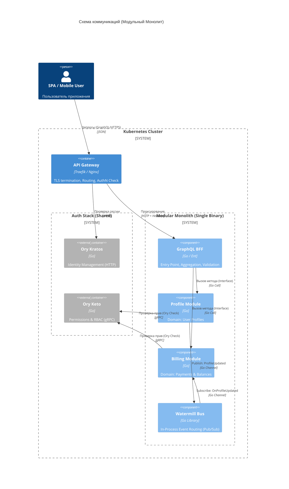

# ADR-002: Выбор протокола межсервисного взаимодействия

**Статус:** Accepted  
**Дата:** 2026-03-07  
**Автор:** kfreiman

## 1. Контекст

Необходимо определить протоколы коммуникации между модулями/сервисами и для внешнего клиентского взаимодействия. С учётом принятой стратегии модульного монолита (см. [ADR-006](./ADR-006-deploy-strategy.md)), характер взаимодействия меняется с чисто сетевого на комбинированный.

**Ограничения:**

1. **Политика проекта:** REST допустим только при наличии сильной архитектурной аргументации.
2. **Язык реализации:** Основной язык бэкенда — Go.
3. **Связь с другими ADR:** ADR-001 зафиксировал использование API Gateway и IAM (Ory). ADR-006 определил стратегию деплоя в виде модульного монолита.
4. **Инфраструктура:** Изначально один исполняемый файл, но архитектура должна допускать безболезненный вынос модулей в отдельные микросервисы.

### 1.1. Роль инфраструктурных компонентов

- **API Gateway (Edge Gateway):** Входная точка в кластер, отвечающая за TLS-termination, маршрутизацию внешнего трафика и первичную проверку сессий в IAM.
- **IAM (Ory Kratos / Keto):** Kratos используется для аутентификации (HTTP/REST), Keto — для авторизации на базе отношений (gRPC).
- **BFF (Backend for Frontend):** Интегрирован в модульный монолит как слой агрегации, предоставляющий GraphQL API для клиентов.

### 1.2. Типы коммуникации

- **Внутреннее взаимодействие (In-process):** Вызовы между контекстами внутри монолита.
- **Внешнее сервисное взаимодействие (S2S gRPC):** Вызовы к сторонним сервисам (Keto) и потенциальным внешним микросервисам.
- **Client-to-BFF (Внешние клиенты):** GraphQL API.
- **Асинхронное взаимодействие:** Событийная шина (Event Bus).

## 2. Принятое решение

### 2.1. Взаимодействие между модулями и внешними сервисами

1. **Внутреннее (между контекстами монолита):** Используются прямые вызовы Go-интерфейсов. Это исключает сетевой overhead и упрощает разработку на начальном этапе.
2. **Внешнее (сторонняя инфраструктура):** Для взаимодействия с сервисами, находящимися вне основного бинарного файла (например, **Ory Keto**), используется **gRPC**.
3. **Будущее масштабирование:** gRPC остается целевым протоколом для случаев, когда модуль будет вынесен в отдельный микросервис. Контракты определяются в `.proto` файлах заранее, даже если сейчас вызов "заглушен" локальной реализацией.

**Преимущества gRPC для S2S:**

- **Производительность:** Бинарная сериализация Protocol Buffers.
- **Надежность контрактов:** Строгая типизация через IDL.

### 2.2. Внешнее взаимодействие (Client-to-BFF): GraphQL

Для связи клиентских приложений с бекендом выбирается **GraphQL**:

- **Гибкость:** Фронтенд запрашивает ровно те данные, которые нужны для конкретного экрана.
- **Единый граф:** Скрывает внутреннюю структуру монолита или набора микросервисов.
- **Оркестрация:** BFF агрегирует данные из разных внутренних модулей или внешних gRPC-сервисов.

**Поток авторизованного запроса:**

1. **Клиент (Web/Mobile) -> API Gateway**: GraphQL over HTTPS. Передается сессионная кука или Bearer токен.
2. **API Gateway -> IAM (Ory Kratos/Keto)**: Проверка валидности сессии (HTTP к Kratos) и базовых разрешений (gRPC к Keto).
3. **API Gateway -> Monolith (BFF)**: Проброс запроса по HTTP с добавлением контекста пользователя в заголовках (например, `X-User-ID`, `X-User-Role`).
4. **BFF -> Внутренние модули**: Вызовы Go-интерфейсов внутри процесса. Контекст пользователя передается через `context.Context`.
5. **Модули -> Внешние сервисы (Keto)**: Вызов по gRPC для детальной проверки прав доступа (Fine-grained access control).

### 2.3. HTTP взаимодействие (REST API)

Используется как вспомогательный протокол:

- **Webhook-и:** (например, от Ory Kratos при регистрации пользователя).
- **Health Checks:** Проверки жизнеспособности для Kubernetes (Liveness/Readiness probes).
- **Интеграция с внешними системами:** Где gRPC/GraphQL не поддерживаются.

### 2.4. Асинхронная коммуникация: Message Broker

Для слабосвязанного взаимодействия между модулями (например, после создания профиля отправить событие в биллинг).

- **Асинхронная релизация в монолите:** [Watermill](https://github.com/ThreeDotsLabs/watermill) в режиме In-Memory (Go channels).
- **Перспектива:** Переход на NATS или Kafka без изменения бизнес-логики, подменой адаптера в Watermill.

## 3. Технические детали

### 3.1. Структура и генерация

- **gRPC:** Интерфейсы описываются в `api/proto/`. Код генерируется для внешних интеграций и как задел на будущее.
- **GraphQL:** Схемы описываются в `api/graphql/`. Для Go используется `gqlgen`.

### 3.2. C4 Container View (Runtime Topology)

## 4. Рассмотренные альтернативы

- **Чистый gRPC между всеми модулями:** Отклонено согласно [ADR-006](./ADR-006-deploy-strategy.md). Слишком высокие накладные расходы на этапе MVP.
- **REST вместо GraphQL для клиентов:** Отклонено. Требует множественных запросов для сложных структур данных и затрудняет развитие API без нарушения обратной совместимости.
- **Общая база данных для коммуникации:** Отклонено. Нарушает изоляцию контекстов и создает "Shared Database" антипаттерн, препятствующий разделению на микросервисы.

## 5. Последствия и риски

### Положительные (Pros)

1. **Низкий Latency:** Внутренние вызовы максимально быстры.
2. **Гибкость фронтенда:** GraphQL упрощает разработку UI.
3. **Масштабируемость:** Система готова к разделению на микросервисы через gRPC.

### Отрицательные / Риски (Cons/Risks)

1. **Скрытая связность:** Риск прямого импорта кода между модулями в обход интерфейсов.
   - **Митигация:** Контроль импортов через линтеры.
2. **Сложность отладки gRPC:** Требуются специальные инструменты (grpcurl) для внешних вызовов.

## 6. История ревизий (Revision History)

- **2026-03-07**: Создан ADR-002 (kfreiman)
- **2026-03-10**: Добавлена альтернатива безсетевого взаимодействия для внутрипроцессных вызовов между контекстами (kfreiman)
- **2026-03-13**: Актуализация под стратегию модульного монолита (ADR-006). gRPC закреплен для внешних сервисов (Keto) и будущего масштабирования. Удалены примеры кода. Добавлен путь авторизованного запроса. (pi-assistant)
