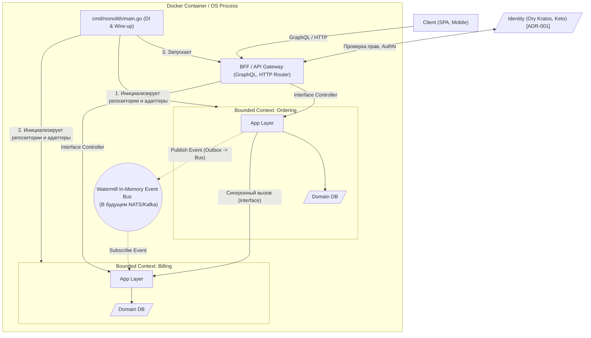

# ADR-006: Стратегия деплоя — Модульный монолит (Single Binary)

**Статус:** Accepted  
**Дата:** 2026-03-09  
**Автор:** kfreiman

## 1. Контекст

Данный ADR касается исключительно доменных Go-сервисов. Важно понимать, что в системе уже присутствуют другие компоненты, с которыми предстоит взаимодействовать по сети (ADR-002):

- Webhook от Ory Kratos;
- Вызовы gRPC с Ory Keto;
- GraphQL API между BFF и фронтендом.

В рамках [ADR-005] была утверждена структура приложения на базе DDD-lite и изолированных Bounded Contexts. Архитектурный выбор деплоя должен строиться на разумном желании отложить реализацию сетевого взаимодействия (написание gRPC/HTTP клиентов между контекстами, обработку обрывов сети, распределенные транзакции) до того момента, когда масштабирование отдельных частей системы станет бизнес-необходимостью.

Предложенная архитектура должна быть зрелой, масштабируемой и эффективной. Отказ от раннего дробления на микросервисы обусловлен тем, что вызовы внутри одного процесса (через интерфейсы) работают быстрее и надежнее сетевых вызовов, позволяя при этом сохранить строгую изоляцию контекстов. Архитектура приложения изначально спроектирована так, чтобы переход на полноценные способы межсервисного взаимодействия (gRPC, NATS, Kafka) проходил бесшовно и без изменения бизнес-логики.

**Ограничения и требования:**

- Избежать преждевременных затрат на разработку сложного сетевого взаимодействия между внутренними контекстами.
- Логика разных контекстов (например, `billing`, `ordering`) должна иметь возможность взаимодействовать друг с другом.
- Требуется сохранить строгую логическую изоляцию компонентов для легкого перехода на микросервисы в будущем, когда в этом появится необходимость.

## 2. Принятое решение

Использовать паттерн **Modular Monolith (Модульный монолит)**.
Все доменные Go-сервисы собираются в **один исполняемый файл (Single Binary)** и разворачиваются как единственный процесс.

Разделение на контексты существует на уровне кодовой базы приложения (`internal/...`). Однако, каждый контекст **полностью изолирован** и, архитектурно, способен иметь собственный сервер и точку входа. Вся логика деплоя, инициализации инфраструктуры и поднятия серверов вынесена исключительно в слой `cmd/` (wireup-уровень). В будущем, для масштабирования, достаточно будет добавить новые папки в `cmd/` (например, `cmd/billing`, `cmd/ordering`), чтобы развернуть контексты как независимые сервисы, не меняя код в `internal/`.

## 3. Технические детали и механизмы

Единственной точкой входа будет `cmd/monolith/main.go`. В этом файле происходит:

1. Инициализация инфраструктуры и репозиториев;
2. Сборка `Application` слоев каждого контекста;
3. Настройка компонентов IAM по [ADR-001] (взаимодействие с Kratos / Keto);
4. Поднятие BFF (согласно [ADR-002]) и роутов серверов;
5. Регистрация всего в едином процессе.

### 3.1 Взаимодействие (Синхронное и Асинхронное) и Консистентность

В рамках монолита внутренние сервисы взаимодействуют в общем адресном пространстве, реализуя при этом заранее согласованные интерфейсы (порты):

- **Синхронное взаимодействие (RPC):** В рамках монолита контексты общаются через прямые вызовы Go-интерфейсов. Интерфейсы (порты) спроектированы так, чтобы в будущем `cmd/` инжектировал сетевые gRPC-клиенты вместо локальных реализаций.
- **Асинхронное взаимодействие (Events):** События публикуются в Event Bus. Для in-memory шины событий будет использоваться библиотека `github.com/ThreeDotsLabs/watermill`. Использование абстракций Watermill позволяет сделать переход от in-memory (Go-каналов) к полноценному брокеру сообщений (NATS, Kafka) практически бесплатным и не требующим изменения бизнес-логики.
- **Консистентность данных и транзакционность:** Поскольку база данных у каждого домена будет своя, распределенные транзакции недопустимы. Гарантия доставки (и обработки) событий решается через паттерн **Transactional Outbox**. Транзакционность ограничивается одним Bounded Context: при сохранении сущности в БД (через `adapters`), в той же транзакции создается запись исходящего события, которое затем асинхронно публикуется в Message Broker.

### Граф архитектуры рантайма (Модульный Монолит)

## 4. Рассмотренные альтернативы

### 4.1. Сразу чистые микросервисы (Один контекст = один процесс/контейнер)

**Суть:** Собирать каждый `internal/[context]` в отдельный бинарник и деплоить через k8s/docker-compose.
**Почему отклонено:** Преждевременная оптимизация, влекущая за собой реализацию распределенного сетевого взаимодействия до того, как в этом возникнет реальная необходимость. Высокие накладные расходы на поддержание сложной сетевой инфраструктуры в ущерб производительности прямого вызова внутри единого процесса (latency). Модульный монолит эффективнее, оставляя при этом возможность такого масштабирования в будущем.

### 4.2. Традиционный монолит (отсутствие строгих границ)

**Суть:** Все компоненты в единой куче без интерфейсов и изоляции, общие слои, общая структура (ADR-005 не выполняется).
**Почему отклонено:** Временный выигрыш в скорости написания кода обернется невозможностью распилить систему на независимые сервисы ввиду сильной связности (Spaghetti Code). Выбранный нами Модульный монолит с DI обязывает соблюдать границы и сохраняет архитектурную чистоту.

### 4.3. Serverless функции (AWS Lambda / Яндекс Cloud Functions)

**Суть:** Деплой каждого endpoint-а как независимой функции.
**Почему отклонено:** Чистая архитектура и DDD подразумевают некоторую тяжеловесность инициализации (DI, сборка слоев). Кроме того, сложно оркестрировать сложную бизнес логику и длительные фоновые процессы.

## 5. Последствия и риски

### Положительные (Pros)

- **Высокая эффективность и производительность:** Контексты делят общее адресное пространство ОС. In-memory шина событий (Watermill) и прямые вызовы интерфейсов работают без сетевых задержек (network latency).
- **Готовность к масштабированию:** Логика деплоя (wireup) ограничена директорией `cmd/`. При необходимости масштабирования достаточно создать `cmd/ordering/main.go` и заменить локальные адаптеры на сетевые gRPC/NATS клиенты. Код в `internal/...` останется нетронутым.
- **Простота операционного развертывания:** Нужен только один `Dockerfile` и простейший pipeline сборки, что ускоряет поставку ценности.

### Отрицательные / Риски (Cons/Risks)

- Разработчики могут нарушить архитектурные границы (ADR-005) и начать импортировать репозитории чужих контекстов напрямую, раз уж всё в одном процессе.
- **Митигация:** Использовать автоматизированные средства контроля или линтеры (например, `go-arch-lint` или `depguard`), которые строго запретят импорты между папками `internal/context_a/...` и `internal/context_b/...`. Взаимодействие должно идти строго через порты (interfaces в слое App/Adapters) или шину событий.

## 6. История ревизий

- **2026-03-09**: Утверждение стратегии Modular Monolith. Замена In-Memory акцентов на отложенную сетевую коммуникацию; уточнение сетевого окружения, добавление Watermill для шины событий.
