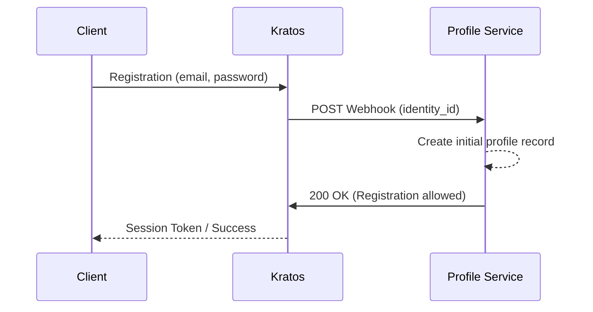

# ADR-007: Определение границ контекста для профиля пользователя

**Статус:** Proposed  
**Дата:** 2026-03-12  
**Автор:** Coding Assistant

## 1. Контекст

В качестве системы Identity Management используется Ory Kratos. Он позволяет хранить дополнительные атрибуты пользователя в поле `traits` (JSON-схема). Необходимо решить: использовать `traits` как основное хранилище данных пользователя или вынести Профиль в отдельный доменный микросервис.

**Требования и ограничения:**

- Сложная бизнес-логика: статусы верификации (KYC), лимиты, история изменений.
- Безопасность: строгий аудит доступа к персональным данным (PII).
- Синхронность: Kratos Webhooks работают синхронно; для завершения регистрации/обновления Kratos ожидает успешный ответ от обработчика.

## 2. Принятое решение

Выделить **Profile** в независимый доменный сервис с собственной базой данных.

Ory Kratos используется исключительно для аутентификации (email, пароль, MFA). Сервис профилей хранит всю бизнес-информацию и связан с Kratos через `identity_id` (UUID).

## 3. Технические детали

- **Регистрация:** Kratos выполняет синхронный Webhook запрос к Profile Service при создании Identity. Profile Service обязан создать начальную запись в своей БД и вернуть `200 OK`, иначе регистрация в Kratos будет прервана.
- **Хранение данных:** Profile Service использует реляционную БД для строгого контроля схем, связей (адреса, документы) и транзакционности бизнес-операций.
- **Интеграции:** Все внешние проверки (верификация личности, адреса) инициируются и отслеживаются в Profile Service.

## 4. Рассмотренные альтернативы

### 4.1. Хранение данных в Kratos Traits

- **Плюсы:** Единственный компонент для управления пользователями.
- **Минусы:**
  - Сложность реляционных связей внутри JSON-документа.
  - Ограниченная валидация (только JSON Schema, без возможности внешних запросов в момент сохранения).
  - Смешивание критической инфраструктуры аутентификации с изменчивой бизнес-логикой.
- **Вердикт:** Отклонено. Не обеспечивает необходимую гибкость для финансового продукта.

## 5. Последствия

### Плюсы

- **Изоляция:** Изменения в логике профиля не влияют на процесс аутентификации.
- **Безопасность:** Возможность внедрения специфичных механизмов защиты PII (шифрование, расширенный аудит) на уровне сервиса профилей.
- **Масштабируемость:** Упрощается построение аналитики и сложных бизнес-процессов (state machine верификации).

### Риски и митигация

- **Синхронная зависимость:** Если Profile Service недоступен, регистрация в Kratos невозможна.
  - *Митигация:* Высокая доступность (HA) сервиса профилей и мониторинг webhooks.
- **Целостность данных:** Риск появления Identity без Профиля при сбоях.
  - *Митигация:* Использование атомарных операций в Profile Service и периодическая сверка (reconciliation) данных между Kratos и базой профилей.

## 6. История ревизий

- **2026-03-12**: Первоначальное создание. Изменение заголовка и стиля, учет специфики Webhooks Kratos. (Coding Assistant)
