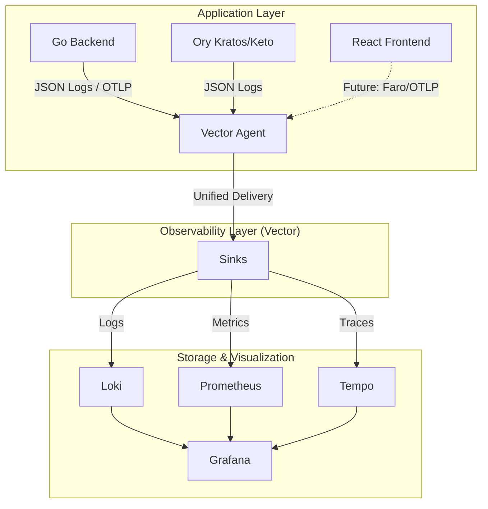

# ADR-008: Выбор стека мониторинга (LGTM + Vector)

**Статус:** Proposed  
**Дата:** 2026-03-12  
**Автор:** kfreiman

## 1. Контекст

Для обеспечения наблюдаемости (observability) системы на базе Go, React и Ory (Kratos/Keto) требуется комплексное решение для сбора, хранения и визуализации телеметрии (логи, метрики, трассировки).

**Основные требования:**

* **Единая точка входа**: унифицированная визуализация всех типов сигналов.
* **Экономичность**: минимальное потребление ресурсов инфраструктуры (CPU/RAM/Storage).
* **Слабая связанность**: возможность замены компонентов без переписывания кода.
* **Корреляция**: возможность легко переходить от лога к трассировке и метрикам.

## 2. Принятое решение

Использовать современный стек **LGTM** (Loki, Grafana, Tempo, Mimir/Prometheus) с **Vector.dev** в качестве единого агента доставки.

### Архитектура

## 3. Обоснование выбора компонентов

### Центр управления: Grafana

Выбрана как индустриальный стандарт для визуализации. Позволяет объединять данные из разных источников (Loki, Prometheus, Tempo) в единых дашбордах и использовать механизм "Derived Fields" для корреляции между логами и трассами.

### Логи: Loki vs ELK (Elasticsearch/Logstash/Kibana)

* **Loki**: Индексирует только метаданные (лейблы), а не само тело лога. Это делает его в разы дешевле в хранении и быстрее при записи. Идеально подходит для Cloud Native окружений и Go-сервисов, где важна скорость и тесная интеграция с Prometheus.
* **Почему не ELK?** ELK потребляет избыточное количество RAM для индексации, требует сложного управления шардами и индексами. Для задач разработки и эксплуатации в рамках данного проекта это "оверхед".

### Трассировки: Tempo vs Jaeger

* **Tempo**: Это хранилище трассировок, которое не требует отдельной сложной БД (Cassandra или Elasticsearch). Оно может использовать обычное дисковое хранилище. Главное преимущество — бесшовная интеграция с Loki.
* **Почему не Jaeger?** Jaeger (в классическом виде) требует управления сложной инфраструктурой хранения для обеспечения масштабируемости. Tempo проще в эксплуатации в рамках self-hosted стека.

### Метрики: Prometheus

Используется как де-факто стандарт. В будущем возможен переход на Grafana Mimir для долгосрочного хранения, но на текущем этапе Prometheus полностью закрывает потребности в Pull-модели сбора метрик.

### Доставка: Vector.dev

Выбран как самый производительный (Rust) и гибкий инструмент для маршрутизации данных. Он позволяет "отвязать" приложение от конкретных бэкендов мониторинга.

## 4. Мониторинг фронтенда (Перспектива)

Для React-приложения планируется внедрение мониторинга в два этапа:

1. **Frontend Logs**: Отправка ошибок через HTTP Source в Vector с последующей пересылкой в Loki.
2. **RUM (Real User Monitoring)**: Интеграция **Grafana Faro SDK**. Это позволит собирать:
    * Web Vitals (LCP, FID, CLS).
    * Console errors и Uncaught exceptions.
    * User session traces для понимания пути пользователя до возникновения ошибки.

Vector будет выступать прокси-приемником для данных Faro, обеспечивая безопасность и фильтрацию перед записью в хранилища.

## 5. Последствия

* **Риски**: Необходимость настройки корректных лейблов (labels) для эффективного поиска в Loki.
* **Выгоды**:
  * Низкий порог вхождения для разработчиков (синтаксис LogQL похож на PromQL).
  * Единый интерфейс Grafana для всех задач отладки.
  * Минимальное влияние на производительность сервисов благодаря Vector.

## 6. История ревизий

* **2026-03-12**: Обоснован выбор observability стека (kfreiman)
