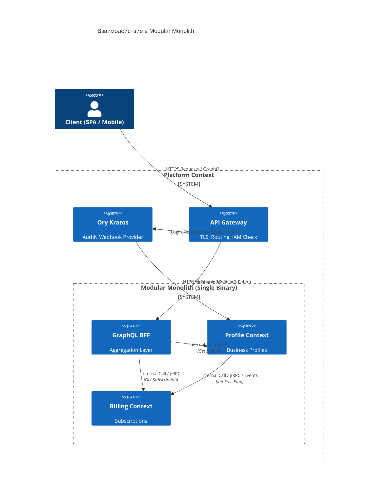

# Документация доменных контекстов (Domain Contexts)

Этот документ описывает Bounded Contexts, реализованные в рамках Modular Monolith.

## Обзор

Приложение разделено на два основных доменных контекста и слой агрегации (BFF), работающие в едином процессе:

1. **Profile** — управление пользователями и бизнес-профилями.
2. **Billing** — подписки и платежи.
3. **BFF (Backend for Frontend)** — GraphQL-фасад, агрегирующий данные из доменных контекстов для клиентов.

## Структура контекста

Каждый контекст следует принципам Clean Architecture:

```
internal/[context]/
├── domain/
│   ├── entity/         # Domain entities с бизнес-логикой
│   ├── valueobject/    # Value objects (immutable)
│   ├── service/        # Domain services
│   └── repository.go   # Интерфейсы репозиториев
├── app/
│   ├── command/        # Command handlers (изменение состояния)
│   └── query/          # Query handlers (чтение данных)
├── adapters/           # Реализации инфраструктуры
├── ports/              # Точки входа (HTTP/gRPC/GraphQL)
└── service/            # Инициализация (wireup) контекста
```

## Контекст Profile

**Назначение**: Управление учетными записями и бизнес-профилями.
**Заметка по Auth**: Согласно [ADR-001], Ory Kratos отвечает за AuthN (пароли, email). Сервис Profile получает webhook при регистрации и управляет только бизнес-профилем. Identity ID от Kratos используется как primary key, что позволяет отделить сервис от чувствительных данных учетных записей.

### Domain Entities

- `Profile` — бизнес-профиль с настройками пользователя (связан с Kratos Identity ID).

### Ключевые операции

- Регистрация/инициализация профиля через Ory Kratos webhook.
- Получение профиля пользователя.

## Контекст Billing

**Назначение**: Подписки и платежи.

### Domain Entities

- `Subscription` — состояние подписки пользователя.

### Ключевые операции

- Инициализация бесплатного плана (оркестрируется из контекста Profile при регистрации).
- Получение статуса подписки.

## Потоки данных и межсервисное взаимодействие (Data Flow)

BFF и доменные контексты разворачиваются как **Modular Monolith** в едином бинарном файле (Single Binary), взаимодействуя через внутренние интерфейсы (In-memory), сохраняя при этом готовность к переходу на gRPC.


